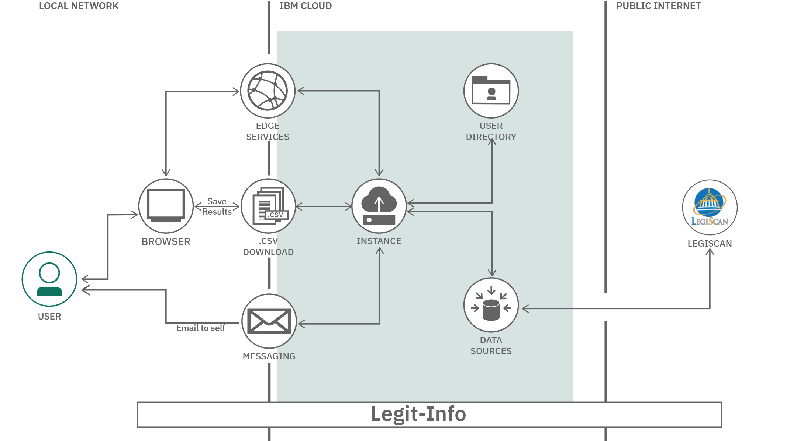

# Call for Code Road Show 2022

This roadshow has 3 modules which contains information on how to modernize an application by containerizing and deploying it on an [OpenShift Container Platform](https://www.redhat.com/en/technologies/cloud-computing/openshift).

We will be utilizing the [Legit Info](https://github.com/Call-for-Code-for-Racial-Justice/Legit-Info) which is a [Call for Code for Racial Justice](https://github.com/Call-for-Code-for-Racial-Justice) project.

Searching for legislation can be complicated by the fact that each government level has their own repository, their own numbering convention, and different formats. Technology can assist by allowing content to be centralized into a single database, in a consistent format, readily accessible to advocates that need simple-to-read information.

Legit Info provides that ready information to help residents understand the impact of legislation and policies based on their country, state, county, city, district location.

Legit Info resources can be updated weekly in the database from the Legiscan government repository.

By classifying legislation by impact and location, we hope to increase awareness of current and pending legislation and their ability to affect change through voting or other activism.

  

## Join the Call for Code for Racial Justice community
Talk to the Legit-Info project team by joining the [Call for Code for Racial Justice community](https://developer.ibm.com/callforcode/racial-justice/get-started?utm_medium=Exinfluencer&utm_source=Exinfluencer&utm_content=000026UJ&utm_term=10008917&utm_id=NA-SkillsNetwork-Gitlab-legitinfocfc2021rj-2021-05-01).

## Contribute to the open source project
Now that you know the different pieces that make up the Legit-Info application, you can contribute back to the open source project on Github. The [issues section](https://github.com/Call-for-Code-for-Racial-Justice/Legit-Info/issues) is a great place to start.

**Authors:**
* Tony Pearson
* Upkar Lidder
* Charlie Evans
* Gaurav Ramakrishna
* Charles Johnson

**Other contributors:**
* Jennifer Judge Clark
