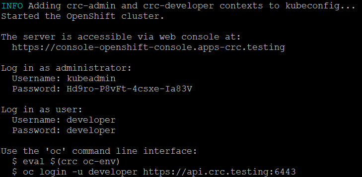

# Connecting to the OpenShift Local instance
In this article we cover the following topics:
-  Starting the OpenShift local instance.
-  Connect to OpenShift via the terminal.
-  Connect to OpenShift via the web console.
-  Creating the `roadshow` namespace (_used in modules 2 and 3_).

## Start the OpenShift Local instance
1.  Open a command prompt or terminal.
2.  Start the instance by running the following command:
    ```
    crc start
    ```
3.  Once complete note the provided configuration details.
    > 

## Connect to OpenShift via the terminal
1. Configure use of the `oc` command:
    - MacOS or Linux
      ```
      eval $(crc oc-env)
      ```
    - Windows
      ```
      crc oc-env | Invoke-Expression
      ```
2. Login to the OpenShift instance:
    ```
    oc login -u kubeadmin https://api.crc.testing:6443
    ```

## Connect to OpenShift via the web console
1. Open the following URL in a browser:
   > https://console-openshift-console.apps-crc.testing<br/>

2.  Login as the user `kubeadmin` using the credentials provided from the `crc start` command.

## Create the **roadshow** namespace
- Command line
  -  Run the following command:
     ```
     oc new-project roadshow
     ```
- WebGUI
  1. Navigate to `Home > Projects`
  2. Select the button **Create Project**
  3. In the _Name_ field enter **roadshow**
  4. Select **Create**