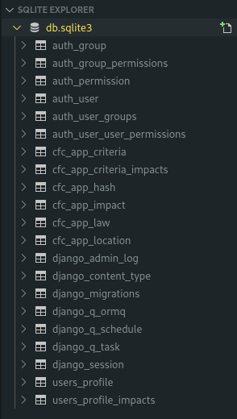
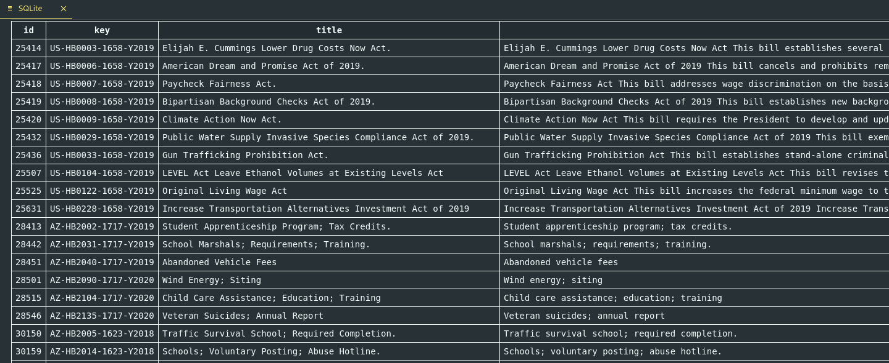
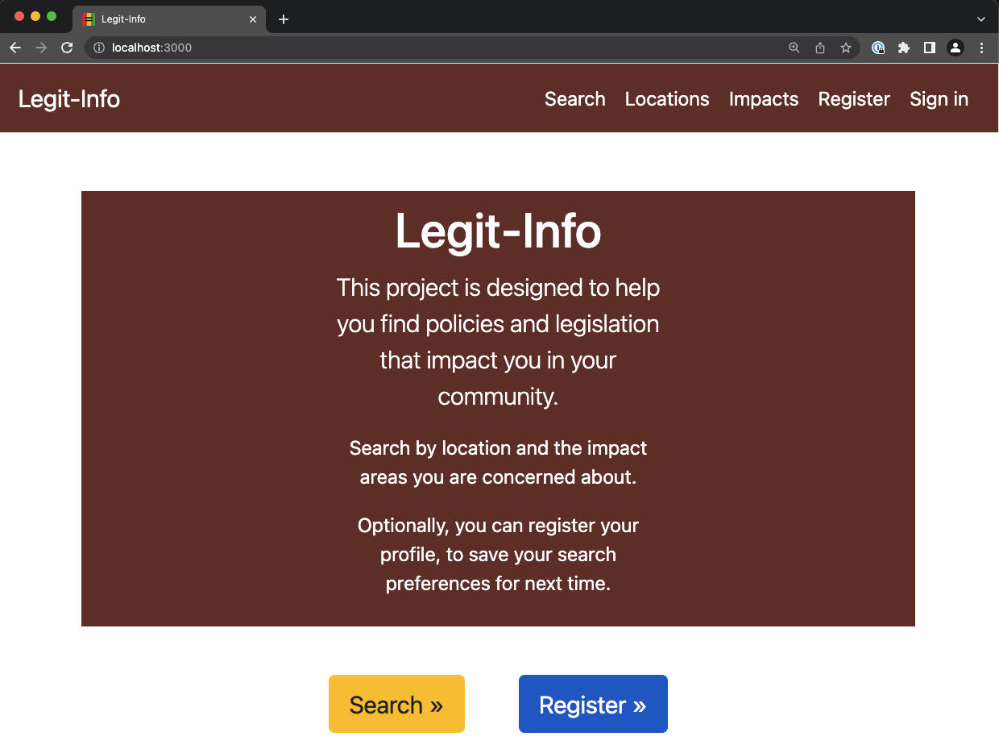
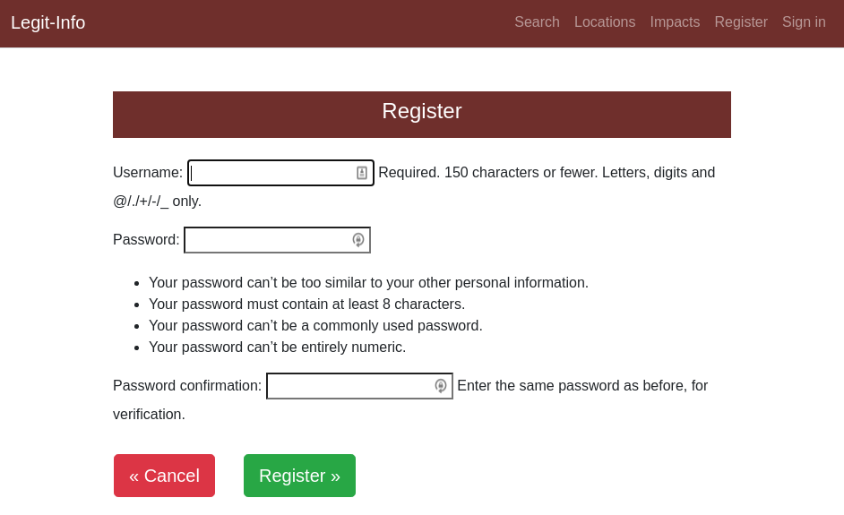
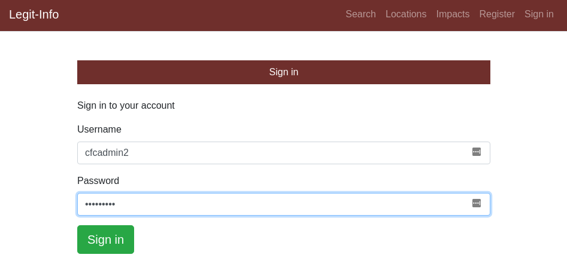
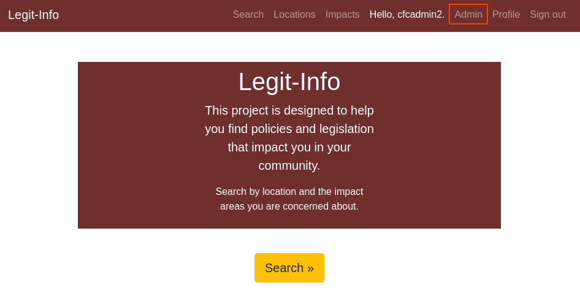
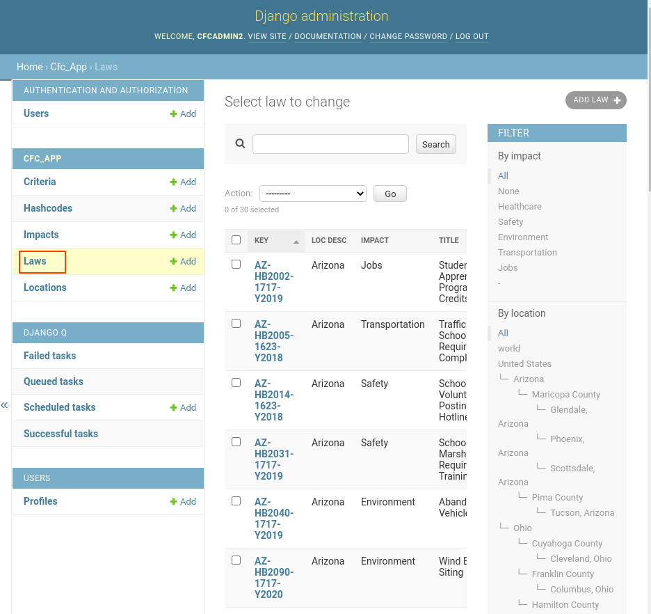

# Module 1 overview

## Learning objectives
At the end of this workshop, you will have deployed the Legit-Info solution in your local environment and started with the first step of modernization: containers. 

The solution uses the following technologies and frameworks:

* Python: The programming language, along with pip and pipenv supporting tools
* Django: A framework for web applications written in Python
* Bootstrap: A popular user interface toolkit, providing "responsive UI" to handle different screen sizes across smartphones, tablets, and desktops
* PDFminer: Extracts text from PDF
* SQLite: A simple, local database
* PostgreSQL: A robust, relational database
* Gunicorn: A WSGI HTTP webserver for Python
* NLTK: Natural Language Toolkit
* Watson Studio Natural Language Understanding
* Docker for containers

The following repositories are used to automate the collection of legislation:
* Legiscan.com: API for all 50 USA states
* AZLeg.gov: Arizona State Legislature website
* Ohio.gov: Ohio State website

# Prerequisites
Please refer to the [Prerequisties](../docs/prerequisites.md) documentation for the necessary tools needed for this workshop.

Afterwards, you can check if the prerequisites are installed using the following commands:

```bash
git --version
```

```bash
docker --version
```

# Clone the repository
The source code for Legit-Info lives on Github. You can either clone the source directory or `fork` the repository to create your own copy and then clone that.

1. Clone the Legit-Info repository:
```bash
git clone https://github.com/Call-for-Code-for-Racial-Justice/Legit-Info.git
```

2. Change into the project directory for next steps:
```bash
cd Legit-Info
```

# The development environment
Normally when a team develops an application locally, they will install the tools and frameworks needed to do their work. There can sometimes be downsides to this approach. Differences in operating systems, language versions, and configurations can create frustrations and slow down development time. 

For this workshop, instead of having to install specific versions of the prerequisites on your local machine, we have opted to introduce a Docker container as the development runtime. This will guarantee compatibility on any operating system that can run Docker and introduces a unique way for teams and individuals to setup development environments for future projects. 

## What are containers and why use them?
Containers are an abstraction that bundles your code files and runs them in an isolated environment that you are certain will have the correct code, framework, and library versions your application requires. Containers also, in most cases, require less resources to execute and are smaller compared to virtual machines or baremetal, allowing you to run more applications. This allows you to, for example, run several containers that use different versions of Python or Django all next to each other without any complications.

Containers are the building blocks for microservices and multi-cloud deployments as they are standardized and very portable. You can create, replicate, and destroy containers very quickly, allowing for faster development cycles and continuous deployments. The sky is the limit!

## Inspect Dockerfile-devenv
The Dockerfile we are using for development purposes is called `Dockerfile-devenv`. We use a Python slim base image to start with. This allows us to target a specific version of Python, 3.9.13 in this case.

We then set some environment variables and install certain dependencies via `pip`. One of the important dependencies is `pipenv`, which allows us to make use of a virtual environment in the container and install application dependencies in the `Pipfile`. This line `RUN PIPENV_VENV_IN_PROJECT=1 pipenv install --deploy` handles installing the dependencies.

We also create a non-root user called `appuser` and change to that user near the end of the file. 

We expose port `8080` as the application runs on that port, which you will see in `entrypoint-dev.sh`. 

## Inspect entrypoint-dev.sh
This file will automatically run a few Django scripts and start our development webserver. The scripts will create and update the database, which is run with SQLite, and will also seed the database with sample data.

The last line starts the web server on port 8080.

## Database
This module uses a local SQLite database to store tables such as:
* user
* user_groups
* user_profiles
* locations
* impacts



In module 2, we will introduce PostgreSQL, which is a more robust database provider.

### Seed data
The provided seed data will input some locations, impacts, and legislation show up when you visit the site.

The first file is located at `sources/cfc-seed.json`. This file contains an admin user to login with and inputs some locations.

The second file is located at `sources/cfc-law30.json`. This file contains some sample legislation information to view.


# Run and launch the application
From the project root directory, we will run the development environment using Docker Compose. The command is:

```bash
docker compose -f docker-compose-devenv.yaml up
```

This will start the services in the compose file and show any logging output in the terminal. You can also run in detatched mode by adding the `-d` flag to the end. This would allow you to free up the terminal to do other things.

Open a browser and navigate to `http://localhost:8080`. You should see the application running.



Now that we have the application running, let's explore it. 

The application has a top menu:
* Search
* Locations
* Impacts
* Sign out
  
## Explore locations
Click on the `Locations` link on the top menu bar. You should see the following locations:
```
United States
└─ Arizona
    └─ Maricopa County
        └─ Glendale, Arizona
        └─ Phoenix, Arizona
        └─ Scottsdale, Arizona
    └─ Pima County
        └─ Tucson, Arizona
└─ Ohio
    └─ Cuyahoga County
        └─ Cleveland, Ohio
    └─ Franklin County
        └─ Columbus, Ohio
    └─ Hamilton County
        └─ Cincinnati, Ohio
```

## Explore impacts
Click on the `Impacts` link on the top menu bar. You should see the following impacts:
```
* Healthcare
* Safety
* Environment
* Transportation
* Jobs
```

## Register new accounts
Click on the `Register` link on the top menu bar to create a new account.



## Admin interface
Django has a built-in administrator interface that you can access from the top URL menu. It reads metadata from your models to provide a quick, model-centric interface where trusted users can manage content on your site. Click on the `Sign in` link to launch the admin interface and log in with the `cfcadmin` username with password `Call4Code`.



Once logged in, click on the `Admin` link to launch the administrative interface.



You can search for a law by clicking on `Laws`



Try searching for laws that have the word `health` in them.


Explore the different filters on the left side to filter laws by impact or location. You will deploy the application to IBM Cloud using the Command Line Interface (CLI) from the terminal in the next step. 

## Finishing up
When you've finished exploring, you can run

```bash
docker compose -f docker-compose-devenv.yaml down
```

to stop the services. If you didn't run in detatched mode above, you may need to CTRL-C first, and then run the down command. 

# Production scenario
Up to this point, we have been using a container to serve our development environment requirements. We can use a nearly identical process to create a container image that can be used for production deployments.

## Inspect the Dockerfile
Open the `Dockerfile` in the root of the project directory. If you compare this Dockerfile to `Dockerfile-devenv`, you will notice quite a lot of similarities. We are using the same base image, but we are also making use of multi-stage builds. A Dockerfile setup in this way allows you to create smaller and more efficient container images by only putting the code and artifacts you need into the final output image while the contents in the intermediate container images.

You can analyze each build section by finding the lines that start with `FROM`. We copy artifacts from other build steps using `COPY --from` and providing the name of the build step. 

The other major difference is that, with the development environment setup, we don't copy the code into the container. We instead using a volume mapping in the `compose` file to map the code into a directory in the container. This allows for developers to make changes to the code and see the updates live. In this "production" Dockerfile, we copy the code into the container and it runs from in the container.

## Build the container image
To build the Dockerfile into a new container image, run 

```bash
docker build . -t legit-info
```
 This command tells Docker to build in the current directory with a tag of `legit-info`. 
You will see some output that downloads the base image and layers each subsequent command in the Dockerfile on top of it. 

After the build finishes, you can run 

```bash
docker images
``` 

to see the list of container images. You should see a line for the `legit-info` image we just built that looks similar to:

```
REPOSITORY       TAG       IMAGE ID       CREATED         SIZE
legit-info       latest    6c76b5885c97   15 seconds ago  1.21GB
```

## Run the containerized application
Now, you can run the container with the following command

```bash
docker run -p 8080:8080 legit-info
```

This command will start the container image `legit-info` that we built before and connects the container's 8080 port to the host's 8080 port.

To see the application running from the container, navigate to `http://localhost:8080` in your browser. You should notice that this container image running looks identical to the development environment version we made use of earlier.

After you have verified the application is running, go back to your terminal and press `Ctrl-C` to stop the container from running.

## Persisting the data between container starts
Now that we finally have our application running in a container, we need to address the database. 

In the previous steps, we worked with a SQLite database file and our Dockerfile ultimately copies the SQLite database file into the container. Containers are ephemeral and stateless, so this means any changes to the information in the SQLite database file will be lost when the container stops. 

This can be addressed in a couple different ways:
* We can mount the SQLite database file from the host system using a volume. This would allow the container to use the same SQLite database file every time.
* We can configure the application to use a more robust database system, such as PostgreSQL and run that either in another container, or via a managed service like IBM Cloud Databases for PostgreSQL.

For now, we will focus on the first point: creating a Docker volume for the database file to persist between sessions.

We can create a Docker named volume with the command 

```bash
docker volume create legit-info-db
```

To use this volume, we run a similar `docker run` command from above and add a new flag (`-v`) to tell the container to use the named volume we created. 

The command is 

```bash
docker run -p 8080:8080 -v legit-info-db:/opt/app-root/src legit-info
```

The parameter for the `-v` flag contains the name of the volume (`legit-info-db`) and the directory inside the container where the file is located (`/opt/app-root/src`). If you remember, our Dockerfile contains a line that sets the working directory, and that is the directory we need in this command.

You can verify the application is running again by navigating to `http://localhost:8080`.

### (OPTIONAL) Verify our database information persists
We can perform a validation step by logging in as our adminstrator account we created earlier and adding a new location.

To do this:
* Click the `Sign In` link at the top right of the navigation bar.
* Enter the credentials you created for your user.
* On successful login, click the Admin link on the navigation bar. You will be taken to the Django Administration backend.
* Click on Locations.
* On the right of the screen, click the `Add Location` button.
* We will enter a new state here. Use the following information:
  * Longname: `Texas`
  * Shortname: `TX`
  * Govlevel: `state`
  * Legiscan Id: `0`
  * Hierarchy: `world.usa.texas`
  * Parent: Select `United States`
  * Click the SAVE button
* Verify the information shows up on the Search page.
  * At the top right of the Django Administration page, click `VIEW SITE`. This will take you back to the home page of Legit Info.
  * Click the `Search` button. 
  * Open the `Locations` dropdown and verify `Texas` shows in the list.
  
Now, we can stop the container from running and restart it to see if our changes persisted like we expect. Back in the terminal, press `Ctrl-C` to stop the container. After the container stops, you can re-enter the same run command 

```bash
docker run -p 8080:8080 -v legit-info-db:/opt/app-root/src legit-info
```

and navigate to `http:localhost:8080`. When you click on the `Search` button, you should still see `Texas` in the Locations list. 

# Next steps

## Continue on to module 2
You can view the next module's instructions [here](../module2/README.md).