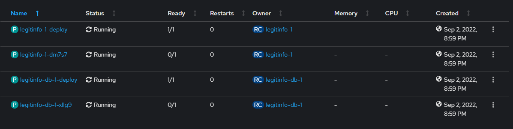
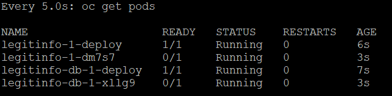
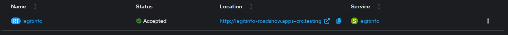
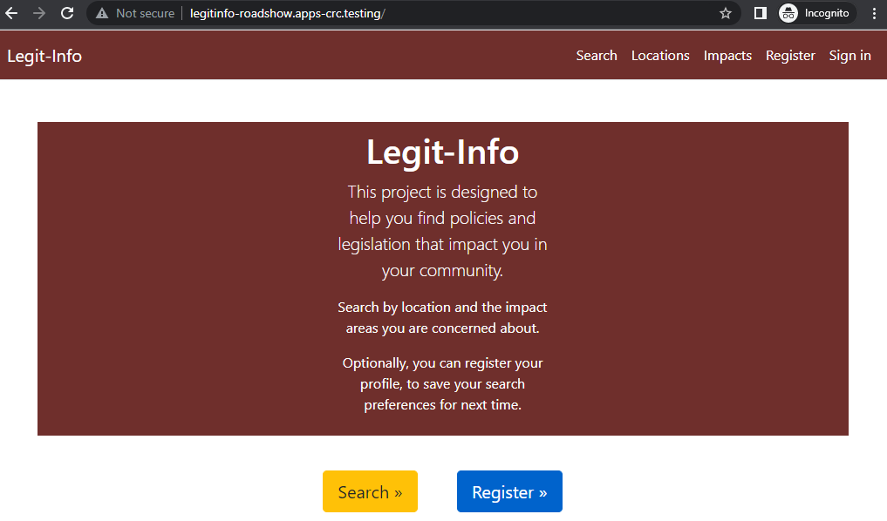

# Deploying to OpenShift
In this module, we will deploy Legit-Info now paired with a PostgreSQL database to OpenShift Local.

## Prerequisites
1.  See [Modules 2 and 3](../docs/prerequisites.md) in the _prerequisites_ article.
2.  Clone the **Legit-Info** project:
    ```
    git clone https://github.com/Call-for-Code-for-Racial-Justice/Legit-Info.git
    ```
3.  Change to the project directory:
    ```
    cd Legit-Info
    ```
4.  Use these [instructions](../docs/connect_to_openshift_local.md) to connect to the OpenShift Local instance.

## Convert the Docker compose file
We will use [kompose](https://kompose.io) to convert the Docker compose creating the following components to deploy on OpenShift:
-  DeploymentConfig
-  ImageStream
-  Route
-  Service
-  Secret

Let's start by review of the file.
1.  Change to the `Legit-Info` folder by using the following command:
    ```
    cd Legit-Info
    ```
2.  Review the **Docker compose file** located in the following directory:
    ```
    configurations/docker/docker-compose.yaml
    ```
3.  For each service **legitinfo** and **legitinfo-db** the _labels_ section is used to define functionality for the pods.<br />
    For example:
    ```
    kompose.service.expose
    ```
    indicates this service will require a route created.  Recommend review of the [kompose](https://kompose.io/user-guide/) documentation for more details.

4.  Run the following command to generate the OpenShift deployment files:
    ```
    kompose --provider openshift -f configuration/docker/docker-compose.yaml --out configurations/openshift/deployment convert
    ```
    the resulting files will require the following adjustments:
    -  The current use of `apiVersion` defined has been deprecated.  Some files will need to be updated to the supported version.<br />
       For example
       ```
       apiVersion: v1
       ```
       will need to be changed to:
       ```
       apiVersion: apps.openshift.io/v1
       ```
       And so forth.  To do so, run the following commands:
       ```
       sed -i "s|apiVersion: v1|apiVersion: apps.openshift.io/v1|g" *-deploymentconfig.yaml
       sed -i "s|apiVersion: v1|apiVersion: image.openshift.io/v1|g" *-imagestream.yaml
       sed -i "s|apiVersion: v1|apiVersion: route.openshift.io/v1|g" *-route.yaml
       ```
    -  Docker only supports very basic use of secrets.  With that said, the secret should be deleted the created again.<br />
       -  Delete the old secret.
          ```
          rm -f openshift/postgresql-secret.yaml
          ```
       -  Create a new one.
          ```
          oc create secret generic postgresql \
            --from-literal=database-name=cfcappdb \
            --from-literal=database-user=pguser \
            --from-literal=database-password=pgpassword
          ```
       -  In the `DeploymentConfig` files, we will update the environment variables to pull their values from the secret.  For example:
          - Change:
            ```
            -  name: POSTGRESQL_DATABASE
                value: "cfcappdb"
            ```
          -  To the following format:
             ```
             - name: POSTGRESQL_DATABASE
               valueFrom:
                 secretKeyRef:
                   name: postgresql
                   key: database-name
             ```
          these changes will need to be made to the following environment variables:
          - POSTGRESQL_DATABASE
          - POSTGRESQL_PASSWORD
          - POSTGRESQL_USER

## Deploy on OpenShift
1.  Make sure your scoped to the project **roadshow** by running the following command:
    ```
    oc project
    ```
    if not run the following command to switch:
    ```
    oc project roadshow
    ```

    If not already done, create the **roadshow** project using the following command:
    ```
    oc new-project roadshow
    ```
2.  Run the following command from the folder:
    ```
    oc apply -n roadshow -f configurations/openshift/deployment/.
    ```

## Monitoring progress
Wait until both pods report a **Ready** status of `1/1`.
-  In the **web console**, navigate to _Workloads > Pods_
   > 
-  Command line
   > 
   -  MacOS or Linux
      ```
      watch -n5 oc get pods
      ```
   -  Windows
      ```
      while (1) {cls;oc get pods;sleep 5}
      ```

## Connect to the application
Let's determine the route to the application.
-  From command line:
   ```
   $ oc get routes
   NAME        HOST/PORT                             PATH   SERVICES    PORT   TERMINATION   WILDCARD
   legitinfo   legitinfo-roadshow.apps-crc.testing          legitinfo   8080                 None
   ```
   here we will use the URL under **HOST/PORT** adding `http://` to the beginning.
-  From the **web console** navigate to _Networking > Routes_ in the table, locate _legitinfo_ then select the copy icon under the _Location_ column.
   > 

Or simply copy the URL below into the browser.
```
http://legitinfo-roadshow.apps-crc.testing
```
And we have...
> 

## Cleaning up
-  Delete deployments
    ```
    oc delete -f configurations/openshift/deployment/.
    ```
-  Delete namespace
    ```
    oc delete ns roadshow
    ```
This process may take to up a minute to complete.  Progress may be monitored using the methods discussed in the section _Monitoring progress_.<br />

## What's next?
Continue to [module 3](../module3/README.md) to learn how to automate updates to this deployment using _Red Hat OpenShift Pipelines_.