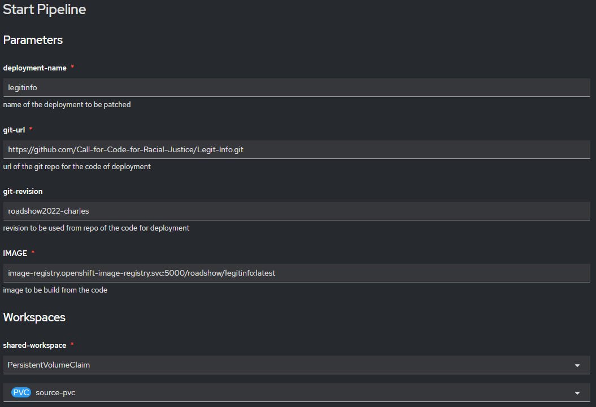

# Automating Updates after Source Code changes
In this module, we will create a continuous integration and continuous delivery (CI/CD) utilizing the [Red Hat OpenShift Pipelines](https://docs.openshift.com/container-platform/4.11/cicd/pipelines/understanding-openshift-pipelines.html) operator to automatically build new images and update the Legit-Info deployment.

[Red Hat OpenShift Pipelines](https://docs.openshift.com/container-platform/4.11/cicd/pipelines/understanding-openshift-pipelines.html) is a cloud-native, continuous integration and continuous delivery (CI/CD) solution based on Kubernetes resources. It uses [Tekton](https://tekton.dev/) building blocks to automate deployments across multiple platforms by abstracting away the underlying implementation details. Tekton introduces a number of standard custom resource definitions (CRDs) for defining CI/CD pipelines that are portable across Kubernetes distributions.

**Key Features:**
- Red Hat OpenShift Pipelines is a serverless CI/CD system that runs pipelines with all the required dependencies in isolated containers.
- Red Hat OpenShift Pipelines are designed for decentralized teams that work on microservice-based architecture.
- Red Hat OpenShift Pipelines use standard CI/CD pipeline definitions that are easy to extend and integrate with the existing Kubernetes tools, enabling you to scale on-demand.
- You can use Red Hat OpenShift Pipelines to build images with Kubernetes tools such as Source-to-Image (S2I), Buildah, Buildpacks, and Kaniko that are portable across any Kubernetes platform.
- You can use the OpenShift Container Platform Developer console to create Tekton resources, view logs of pipeline runs, and manage pipelines in your OpenShift Container Platform namespaces.

## Prerequisites
1.  See [Modules 2 and 3](../docs/prerequisites.md) in the _prerequisites_ article.
2.  Clone the **Legit-Info** project:
    ```
    git clone https://github.com/Call-for-Code-for-Racial-Justice/Legit-Info.git
    ```
3.  Change to the project directory:
    ```
    cd Legit-Info
    ```
4.  Use these [instructions](../docs/connect_to_openshift_local.md) to connect to the OpenShift Local instance.

## Create the OpenShift deployment
Run the following command to deploy the project on OpenShift.
```
oc apply -n roadshow -f configurations/openshift/deployment/.
```

## Monitoring progress
Wait until pods (not ending in _deploy_) report a **Ready** status of `1/1`.
-  In Web UI, navigate to _Workloads > Pods_
    > 
-  Command line
    > 
-  MacOS or Linux
    ```
    watch -n5 oc get pods
    ```
-  Windows
    ```
    while (1) {cls;oc get pods;sleep 5}
    ```

## Install the Red Hat OpenShift Pipelines operator
1.  Login to the OpenShift Web Console
    ```
    https://console-openshift-console.apps-crc.testing
    ```
2.  From the left navigation, select _Operators > OperatorHub_
3.  In the search field, enter `pipeline`
4.  Select the **Red Hat OpenShift Pipelines** operator.
    > 
5.  On the following menu, select **Install**
    > 
6.  Accept the defaults and select **Install**.
    > 
7.  Once install is complete, a **Pipelines** option will appear in the left navigation.
    > 

## Deploy the pipeline configuration
From the terminal, run the following command:
```
oc apply -f configurations/openshift/pipeline/.
```

## Create and start a Pipeline Run
1.  Open the web console
2.  Navigate to _Pipelines > Pipelines_
3.  Select `build-and-deploy`
    > 
4.  In the top-right corner, select _Actions > Start_
    > 
5.  Complete the form _Start Pipeline_ as follows:
    > 
    - deployment-name: `legitinfo`
    - git-url: `https://github.com/Call-for-Code-for-Racial-Justice/Legit-Info.git`
    - git-revision: `main`
    - IMAGE: `image-registry.openshift-image-registry.svc:5000/roadshow/legitinfo:latest`
    - shared-workspace: `PersistentVolumeClaim > source-pvc`
6.  Select **Start** in the bottom right corner.

## Monitor Pipeline Run progress
1.  Under **Last Run** column select the top entry.
    > 
2.  Select the **Logs** tab.
    > 

From here you may monitor the progress of each task.

## Cleaning up
-  Delete deployments
    ```
    oc delete -f configurations/openshift/deployment/.
    ```
-  Delete Tekton pipeline configuration
    ```
    oc delete -f configurations/openshift/pipeline/.
    ```
-  Delete namespace
    ```
    oc delete ns roadshow
    ```
This process may take to up a minute so to complete.  Progress may be monitored using the methods discussed in the section _Monitoring progress_.<br />

## What's next?
- Try integrating with some security elements like:
  - Running Unit Tests
  - Ensure continuous code quality and security by scanning the code base with [SonarQube](https://www.sonarqube.org/).
    - SonarQube detects bugs, vulnerabilities, and code issues. It can integrate with your workflow to enable continuous code inspection across your project branches and pull requests. The tool reports the overall health and quality of your source code and highlights issues that are found in new code. The code analyzers detect tricky bugs, such as null-pointer dereferences, logic errors, and resource leaks, for more than 20 coding languages.
    - SonarQube fits with your tools. You are proactively notified when the quality or security of your codebase is at risk. Non-disruptive code quality checks overlay your workflow and intelligently promote clean builds.
    - Refer the [SonarQube documentation](https://docs.sonarqube.org/latest/)
- Try adding Triggers for the pipeline to automatically run the pipeline to build and deploy the project when new changes are merged to Git repo. Please refer the [OpenShift documentation](https://docs.openshift.com/container-platform/4.11/cicd/builds/triggering-builds-build-hooks.html) to learn more about adding Triggers.